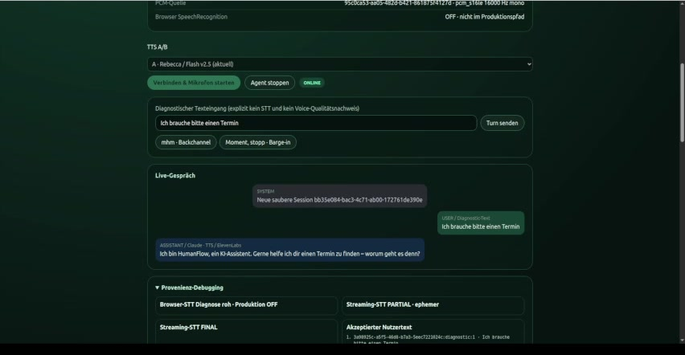

[](https://github.com/ghostvenumai/humanflow/actions/workflows/ci.yml)

# HumanFlow

**Ein deutscher Echtzeit-Voice-Agent mit Fokus auf den schwierigen Teil von
Speech-to-Speech: Turn Detection, Barge-in, Playback Ownership, Gesprächszustand,
Tool-Grounding und Failure Recovery.**

HumanFlow läuft über einen echten Browser-/Mikrofonpfad: Streaming-STT, ein
Claude-Reasoner, SQLite-geerdete Termin-Tools und Streaming-TTS — mit Schwerpunkt auf
*Zuverlässigkeit* statt einer Happy-Path-Demo.



*Live-Browser-Session: Streaming-STT, ein geerdeter deutscher Termin-Dialog, der
aktive TTS-Provider und Provenienz/Telemetrie pro Turn.*

---

## Zeitrahmen

Dieses Projekt entstand im Zeitfenster der Everlast Developer Challenge: drei Tage
Kernentwicklung plus ein Konsolidierungstag. Die Spanne ist über `git log`
nachprüfbar — der erste Commit datiert auf 2026-08-23 17:08, die Runtime- und
Feature-Arbeit lief bis 2026-08-26.

Commits pro Entwicklungstag:

| Tag | Commits |
|---|---|
| 2026-08-23 | 39 |
| 2026-08-24 | 42 |
| 2026-08-25 | 27 |
| 2026-08-26 | 9 |

Der Großteil der Substanz — 81 der 117 Commits dieser vier Tage — fiel auf die
ersten beiden Tage; danach Konsolidierung und Absicherung. Die Commits ab dem
2026-08-27 betreffen Rahmung, Dokumentation und CI, nicht die Runtime.

Selbst nachvollziehbar mit:

```bash
git log --format=%ci | cut -d' ' -f1 | sort | uniq -c
```

## Was es kann

- Natürliches **deutsches Multi-Turn**-Sprachgespräch.
- **Turn Detection** über Scribe-Transkriptzustand, Server-VAD,
  Backchannel-Vokabular und explizite deutsche Unterbrechungsphrasen.
- **Barge-in** als echter Zustandsübergang (erkennen → validieren → Wiedergabe
  stoppen → TTS abbrechen → veraltete Antwort invalidieren → neuen Turn annehmen),
  kein bloßes `stop()`.
- **Backchannel-Toleranz** — „mhm", „okay", „aha" brechen den Agenten nicht ab.
- **Played-Audio-Wahrheit**: Ein Ledger unterscheidet erzeugtes / eingereihtes /
  abgespieltes / abgebrochenes Audio, sodass der Gesprächszustand nie annimmt, der
  Nutzer habe Inhalte gehört, die vor der Wiedergabe abgebrochen wurden.
- **Tool-geerdete Termine** gegen eine autoritative lokale **SQLite**-Quelle —
  Verfügbarkeit, Buchung, Verschiebung, Absage — niemals halluzinierte Slots.
- **Deterministische deutsche Datumsauflösung** (z. B. ist *„Mittwoch in zwei
  Wochen"* zwei volle Wochen und distinkt von *„nächsten Mittwoch"*).
- **Failure Recovery** und ein evidenzgetriebener **Engineering-Improvement-Loop**.

## Architektur

```
Mikrofon
  → ElevenLabs Scribe (Streaming-STT)
  → Turn Detection / Final Admission
  → Conversation Controller (State Machine, Operation-Epochs, Cancellation)
  → Claude Reasoner (Messages API)
  → Geerdete Tools / SQLite (Termine)
  → ElevenLabs Streaming-TTS
  → Playback Controller (Single-Owner, cancel-aware)
  → Browser-Audio
```

## Reliability-Highlights

Dies sind reproduzierte und getestete Verhaltensweisen, jeweils durch deterministische
Regressionstests abgesichert:

- Ein permanenter **THINKING-Deadlock** wurde reproduziert und behoben — eine Antwort,
  die nie Audio erreicht, kann die Session nicht mehr stranden lassen.
- Eine **stalled Pre-playback-Generation** recovert deterministisch nach `LISTENING`.
- Ein **legitimer neuer User-Turn während eines Stalls** geht nicht mehr verloren —
  er übernimmt.
- **Late-/Stale-Audio-Schutz**: Nach einer Cancellation kann altes Audio nie hörbar
  werden oder den State ändern.
- Ein **transienter Pre-first-audio-TTS-Fehler** wird **einmal** mit demselben,
  bereits erzeugten Text geretryt — Tool und Reasoner werden **nicht** erneut
  ausgeführt (keine doppelten Seiteneffekte, keine zweite LLM-Anfrage).
- Die Speech-Retry-Boundary ist auf echte Stream-/Provider-Fehler verengt, sodass ein
  interner Nicht-TTS-Fehler nie fälschlich als transienter TTS-Retry klassifiziert
  wird.
- **Barge-in / Cancellation** umgehen den Speech-Retry immer.
- Termin-Verfügbarkeits-Follow-ups bleiben **typ-erhaltend und geerdet** (ein
  generisches „was ist sonst frei?" verbreitert auf echte Alternativen, statt die
  ganze Datenbank auszugeben oder fremde Terminarten zu leaken).

## Der Engineering-Improvement-Loop

**HumanFlow wurde selbst mit einem agentischen, loop-basierten Engineering-Prozess
entwickelt.** Statt Fixes manuell und einmalig zu schreiben, läuft die Entwicklung
über einen kontrollierten Agenten-Loop: beobachten → triagieren → Modell wählen →
reproduzieren → implementieren → verifizieren → adversarial prüfen → Evidenz bewerten
→ KEEP/REJECT → nächste Aufgabe. Jeder Fix-Kandidat entsteht in einem isolierten
Worktree, durchläuft dieselben immutablen Tests und Quality Gates und wird nur mit
expliziter Evidenz übernommen.

Über die Runtime-Self-Recovery hinaus ist dieser **Engineering-Improvement-Loop** als
Teil des Projekts vorhanden: Probleme werden zu Tasks und isolierten Fix-Kandidaten,
verifiziert durch gezielte Tests, adversariale Prüfung und protected/golden Checks,
mit persistenten Findings/Metriken und expliziten KEEP-/REJECT-Gates vor einem
kontrollierten Freeze.

Während der Behebung des ursprünglichen TTS-/THINKING-Problems hat eine adversariale
Prüfung einen *zusätzlichen* Race-Condition-Fehler aufgedeckt, der **nicht** Teil des
ursprünglichen Reports war — ein legitimer neuer User-Turn konnte während eines
Pre-playback-TTS-Stalls verloren gehen. Er wurde reproduziert, getestet und behoben.
(HumanFlow schreibt **nicht** während eines Live-Kundengesprächs seinen eigenen
Produktionscode um; Runtime-Anomalien werden unter menschlich gegateter Prüfung in
Engineering-Tasks überführt.)

Die Evidenz dieses Prozesses liegt im Repo:
[`.engineering/problems.json`](.engineering/problems.json) (erkannte Probleme),
[`.engineering/tasks/`](.engineering/tasks/) (Task-Definitionen mit
Akzeptanzkriterien), [`.engineering/evidence.jsonl`](.engineering/evidence.jsonl)
(Evidenz-Log) sowie [`docs/engineering-harness/`](docs/engineering-harness/) (Audit
und Validierung). Jeder Fix in der Commit-History geht auf ein reproduziertes Problem
zurück, nicht auf Refactoring-Rauschen — nachvollziehbar an den `fix:`-Commits und
ihren begleitenden Regressionstests.

## Tech-Stack

Python 3.12 · FastAPI · Anthropic Messages API (Claude) · ElevenLabs Scribe (STT) ·
ElevenLabs Flash v2.5 (Streaming-TTS) · SQLite · dependency-freie deterministische
Test-Adapter.

## Tests

- **Eingefrorener Everlast-Kandidat** (`humanflow-everlast-frozen-20260826`,
  validierter Runtime-Stand `ea3677e`): **367** automatisierte Tests bestanden; eine
  reale Browser-/Audio-Multi-Turn-Session wurde menschlich validiert.
- **Post-Freeze-Demo-Kandidat** (zusätzliche, adversarial verifizierte Termin-/
  Temporal-Fixes): **385** lokale Tests bestanden.

Diese beiden Stände werden getrennt gehalten und nicht vermischt.

## Umfang & Ehrlichkeit

- Validiert auf einem **echten Browser-/Real-Audio**-Multi-Turn-Pfad.
- **Keine** Produktions-Telephony-/PSTN-Zertifizierung und **keine**
  Produktions-SLA-Aussage.
- Latenzwerte im Repo sind als lokal/simuliert gekennzeichnet und sind keine
  Real-Call-Latenzmetriken.
- Die Natürlichkeit der Stimme und die Verständlichkeit jeder Antwort bleiben eine
  menschliche Bewertung.
- Der WebSocket-Endpoint `/ws` akzeptiert Verbindungen ohne Origin-Prüfung und ohne
  Session-Authentifizierung (`websocket_session` → `await websocket.accept()`). Für
  den lokal gebundenen Demo-Betrieb (127.0.0.1) ist das unkritisch; für eine
  exponierte Umgebung ist der Endpoint in dieser Form nicht geeignet.

### Fail-Closed-Gates

Mehrere Zustände sind bewusst geschlossen: ohne echte Provider bricht der Dienst ab,
statt ein Gespräch zu simulieren. Die folgenden Gates stammen aus dem Code
(`src/humanflow/web/app.py`):

| Gate | Warum geschlossen | Was zum Öffnen fehlt |
|---|---|---|
| Server-Start ohne Credentials (`lifespan` wirft `RuntimeError`) | Kein Fake-Gespräch statt echter Pipeline | `ANTHROPIC_API_KEY`, `ELEVENLABS_API_KEY`, `ELEVENLABS_VOICE_ID` in `runtime.env` |
| Reasoning-Provider ≠ `anthropic` (`blocker: unsupported reasoning provider`) | Nur der Anthropic-Reasoner ist implementiert | `HUMANFLOW_REASONING_PROVIDER=anthropic` (Default) |
| STT ohne Key (`blocker`, Status `MISSING_API_KEY`) | Kein Browser-STT-Fallback im Produktionspfad | `ELEVENLABS_STT_API_KEY` (oder `ELEVENLABS_API_KEY` mit STT-Scope) |
| TTS ohne Key/Voice (`blocker: missing TTS configuration`) | Echte Stimme erforderlich; ungültige Credentials scheitern closed | `ELEVENLABS_API_KEY` und `ELEVENLABS_VOICE_ID` |
| `/ws` ohne echte Provider (`close 1011`, `real_reasoning_provider_unavailable`) | Keine WebSocket-Session ohne vollständige Pipeline | Konfigurierte Provider (siehe oben) |
| `/ws` bei belegtem Playback (`close 1008`, `another_browser_session_owns_playback`) | Playback ist Single-Owner (Barge-in-/Ledger-Integrität) | Die andere Browser-Session muss die Wiedergabe freigeben |

## Bekannte Strukturschuld

`src/humanflow/runtime/session.py` umfasst 2.786 Zeilen; die zentrale Methode
`_run_response` allein rund 566. Sie enthält den Reasoner-Stream-Loop, darin die
Prosody-Segment-Schleife, darin die TTS-Versuchs-Schleife und den Chunk-Consume-Loop
— mehrere ineinander verschachtelte Schleifen samt `try`/`except`/`finally` für
Cancellation und Recovery.

Das ist eine bewusste Entscheidung unter Zeitdruck: Die Iterationsgeschwindigkeit lag
in der Runtime-Schicht, während Domain-Modell, Ledger und State Machine sauber
getrennt gehalten wurden.

Der geplante nächste Schritt ist, die TTS-Segment-Schleife samt Retry-Behandlung in
eine eigene Einheit (etwa `_SpeechSegmentRunner`) zu extrahieren; die bestehende
Testsuite deckt diesen Umbau ab. Dieser Umbau ist ausdrücklich **nicht** Teil des
eingefrorenen Stands.

## Demo starten

```bash
python3 -m pip install -e '.[demo]'
# ANTHROPIC_API_KEY, ELEVENLABS_API_KEY, ELEVENLABS_VOICE_ID
#   in $HOME/.config/humanflow/runtime.env hinterlegen  (niemals Secrets committen)
make demo   # bedient http://127.0.0.1:8765
make test   # führt die automatisierte Suite aus
```

Der Server ist **fail-closed**: Ohne echte Provider-Credentials startet er nicht,
statt auf ein Fake-Gespräch zurückzufallen.
